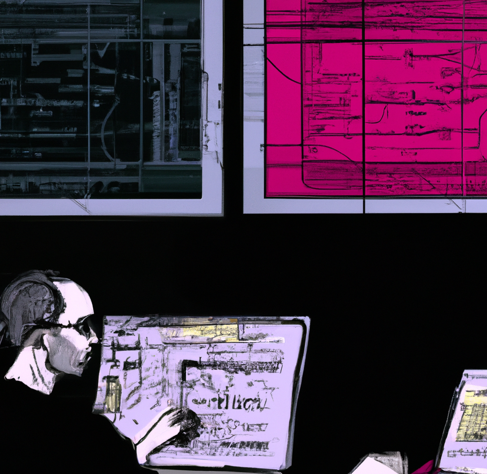

```{r, include = FALSE}
knitr::opts_chunk$set(
  collapse = TRUE,
  comment = "#>"
)
```

# Shiny for Scientists Workshop

```{r out.width='40%', out.extra='style="float:right; padding:10px"', echo = FALSE}

```

Authors:
    Jared Andrews^[St. Jude Children's Research Hospital]
    <br/>
Last modified: April 18th, 2023.

## Overview

### Description

This workshop is designed to introduce participants to the basics of R Shiny, a web application framework for R. 
Shiny is a powerful tool that can be used to create interactive, re-usable, and shareable web applications that can be used to explore and visualize data, and to create interactive reports. 
In particular, this curriculum is geared towards scientists and bioinformaticians to emphasize how Shiny can streamline common analyses, figure generation, and empower bench scientists to explore and interpret their data. 

### Pre-requisites

This workshop expects participants to have:

* Basic knowledge of R syntax
* Basic familiarity with the RStudio IDE

Additional reading that may be helpful:

* [Shiny Basics](https://shiny.rstudio.com/tutorial/written-tutorial/lesson1/)
* [Mastering Shiny](https://mastering-shiny.org/)

### Participation

This workshop is designed as an instructor-led, hybrid-format experience. 
The material will remain available online for self-paced learning indefinitely.

### _R_ / _Bioconductor_ packages used

List any _R_ / _Bioconductor_ packages that will be explicitly covered.

### Workshop outline

This workshop was designed to be convered in ~2.5-3 hours and includes 4 hands-on modules:

| Activity                     | Time |
|------------------------------|------|
| Core Shiny Concepts                     | 30m  |
| Basic App Development         | 30m  |
| Adding Complexity, Interactivity, and Generalizing an App | 90m   |
| Debugging Shiny, Common Gotchas, and Deployment Options               | 30m  |

### Learning goals

The goals of this workshop are to help participants:

1.	recognize how interactive, re-usable tooling can help them work more efficiently and effectively,
2.	understand how such tooling can empower laboratory scientists to better understand and investigate their data to derive meaningful insights,
3.	and gain a strong foundational knowledge of basic R Shiny functionality and development that they can incorporate into their own work.


### Learning objectives

* analyze xyz data to produce...
* create xyz plots
* evaluate xyz data for artifacts

